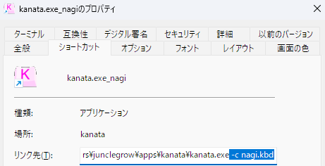

# nagi

薙刀式配列を[kanata](https://github.com/jtroo/kanata)でエミュレートします。kanataは高機能なキーボードリマッパです。

なお、kanataの仕様や、個人用に制作した兼ね合いにより、公式マニュアルと違う箇所があります。ご了承ください。変えたい場合は、kanataのマニュアルを読む、nagi.kbdから推測する、AIに聞くなどしてください。

## 薙刀式バージョン

v16快速版

## 使い方

1. nagi.kbdと[kanata](https://github.com/jtroo/kanata)をダウンロード
1. kanataのショートカットを作成し、リンク先に`-c nagi.kbd`と追加
1. ショートカットから起動

## 公式と異なる箇所

- 左シフトでIMEOFF、右シフトでIMEON
- 編集モードは個人的な好みにしてある
- Markdownに特化した編集モードを用意してみた

## 既知の不具合

- 右シフトでIMEが有効にならないことがある
